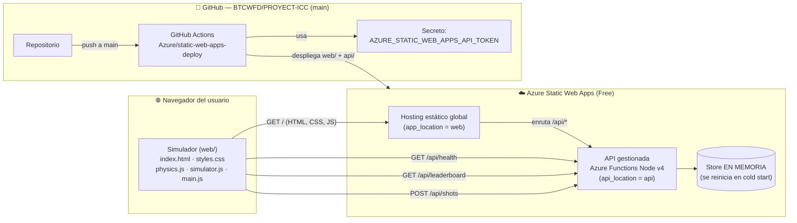

# 🏛️ Arquitectura de la ICC — Simulador Web + API gestionada

> Documento de arquitectura de solución para la **Fase 1** de la Interplanetary
> Champions Cup (ICC). Describe el flujo de datos, las decisiones de diseño y la
> ruta de evolución sobre **Azure Static Web Apps (SWA)**.
>
> **Clasificación:** Confidencial / Estratégico — Oficina del CTO.

---

## 1. Visión general

La Fase 1 entrega un **Simulador Web de Física Lunar** (HTML/CSS/JS sin paso de
build) acompañado de una **API gestionada de Azure Functions** que registra los
disparos de la comunidad y publica una **tabla de clasificación** (leaderboard).
Todo se sirve desde **un único recurso de Azure Static Web Apps (tier Free)**, con
CI/CD automático mediante GitHub Actions.

Esto materializa el objetivo de la Fase 1 del white paper V3.0 ("Hype Digital":
simulador + clasificatorias virtuales) sin incurrir en costes de infraestructura.

---

## 2. Diagrama de flujo

### Flujo resumido

1. El navegador descarga los archivos estáticos del simulador desde el CDN de SWA.
2. El simulador calcula trayectorias **en el cliente** (`web/js/physics.js`).
3. Al guardar un disparo, el front llama a `POST /api/shots`; para refrescar el
   ranking llama a `GET /api/leaderboard`; `GET /api/health` sirve de sonda.
4. SWA enruta automáticamente todo lo que cuelga de `/api/*` a las Azure Functions
   gestionadas (sin necesidad de gestionar CORS ni un host de Functions aparte).
5. Cada `git push` a `main` dispara GitHub Actions, que reconstruye y publica.

---

## 3. Contrato de API (compartido)

Todos los componentes respetan **exactamente** este contrato:

| Método | Ruta              | Cuerpo / Respuesta |
|--------|-------------------|--------------------|
| `GET`  | `/api/health`     | → `{ "status":"ok", "service":"icc-api", "version":"1.0.0" }` |
| `GET`  | `/api/leaderboard`| → `{ "entries": [ { "club":string, "world":"moon"\|"earth", "range":number, "hangTime":number } ] }` (orden **descendente por `range`**) |
| `POST` | `/api/shots`      | body `{ "club":string, "world":"moon"\|"earth", "power":number, "angle":number, "range":number, "hangTime":number }` → `{ "ok":true, "rank":number, "total":number }` |

- `world` toma los valores `"moon"` / `"earth"`, alineados con las claves de
  `WORLDS` en `web/js/physics.js`.
- `range` (alcance, m) y `hangTime` (tiempo de vuelo, s) son las métricas estrella
  que el simulador ya calcula (`computeTrajectory` devuelve `range` y `flightTime`).
- El ranking se ordena por `range` descendente: el disparo más largo encabeza la
  tabla, reforzando el "gancho físico" de la baja gravedad lunar.

---

## 4. Decisiones de diseño

### 4.1 ¿Por qué SWA Free + Functions gestionadas?

- **Coste cero en Fase 1.** El tier **Free** de SWA cubre hosting estático global,
  certificado HTTPS, dominios y CI/CD. Encaja con la naturaleza de "Hype Digital"
  de la Fase 1, donde el objetivo es difusión, no facturación.
- **Un solo recurso, una sola URL.** El front y la API conviven bajo el mismo
  origen: `https://<app>/` y `https://<app>/api/*`. Esto **elimina la
  configuración de CORS** y simplifica el despliegue.
- **Functions gestionadas (managed).** SWA aprovisiona y opera el host de Azure
  Functions por nosotros; no hay que crear ni mantener un Function App separado.
- **Sin paso de build.** El simulador es HTML/JS plano (sin bundler), por eso
  `output_location = ""`. SWA publica el contenido de `web/` tal cual.

### 4.2 Mapeo de ubicaciones (app / api / output)

Configuración usada por el workflow de despliegue:

| Parámetro          | Valor   | Significado |
|--------------------|---------|-------------|
| `app_location`     | `web`   | Carpeta del frontend estático (lo que ve el navegador). |
| `api_location`     | `api`   | Carpeta de las Azure Functions (Node, modelo v4). |
| `output_location`  | `""`    | Sin artefacto de build: se publica `web/` directamente. |

> Nota: el `index.html` de la **raíz** del repo es un redirector pensado para
> GitHub Pages. En SWA, el contenido servido es el de `app_location = web`.

### 4.3 Store en memoria (provisional)

La API usa un **store en memoria** para los disparos. Es deliberadamente simple
para la Fase 1, pero implica que **los datos se pierden en cada cold start** del
Function App. Es aceptable para una demo/"hype", no para producción real.

---

## 5. Ruta de evolución

Alineada con el roadmap del white paper V3.0:

### Fase 1 — Hype Digital (estado actual)
- Simulador web + API de leaderboard con store en memoria sobre SWA Free.

### Hacia Fase 2 — MVP "Primer Toque"
1. **Persistencia real.** Migrar el store en memoria a **Azure Table Storage**
   (opción más económica) o **Cosmos DB** (si se requiere baja latencia global y
   consultas más ricas). El contrato de API no cambia: solo la capa de datos.
2. **Identidad y anti-trampas.** Activar **autenticación de SWA** (proveedores
   integrados: GitHub, Microsoft, etc.) para asociar disparos a usuarios reales,
   validar `POST /api/shots` en servidor y evitar leaderboards falseados.
3. **Telemetría real.** Sustituir disparos simulados por datos del MVP físico
   (1 robot + 1 balón en la Luna), manteniendo el mismo esquema `range`/`hangTime`.

### Hacia Fase 3 — Liga ICC
4. **Escalado.** Pasar a SWA Standard (SLA, mayor cuota de Functions) y considerar
   Cosmos DB multi-región.
5. **VR / "asientos virtuales".** Integrar el "gemelo digital" y los *VR tickets*
   del white paper, consumiendo la misma API de eventos/clasificación.

---

## 6. Relación con las fases del white paper

| Fase white paper | Entregable técnico | Componente de esta arquitectura |
|------------------|--------------------|---------------------------------|
| **Fase 1 (0-12 m)** — Hype Digital | Simulador + clasificatorias virtuales | `web/` (simulador) + `api/` (leaderboard) sobre SWA Free |
| **Fase 2 (12-24 m)** — MVP "Primer Toque" | Telemetría de 1 robot real | Persistencia (Table/Cosmos) + auth SWA |
| **Fase 3 (año 3+)** — Liga ICC | Domo, múltiples unidades, VR tickets | Escalado SWA Standard + Cosmos + gemelo digital/VR |

El simulador demuestra el **gancho físico** de la marca (la gravedad 1/6 g produce
alcances de cientos de metros y *hang-time* de segundos), y la API lo convierte en
una experiencia **social y competitiva** desde el primer día, sin coste de
infraestructura.
