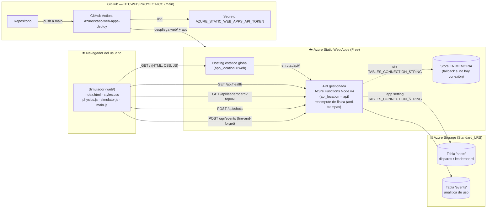

# 🏛️ Arquitectura de la ICC — Simulador Web + API gestionada

> Documento de arquitectura de solución para la **Fase 1** de la Interplanetary
> Champions Cup (ICC). Describe el flujo de datos, las decisiones de diseño y la
> ruta de evolución sobre **Azure Static Web Apps (SWA)**.
>
> **Clasificación:** Confidencial / Estratégico — Oficina del CTO.

---

## 1. Visión general

La Fase 1 entrega un **Simulador Web de Física Lunar** (HTML/CSS/JS sin paso de
build) acompañado de una **API gestionada de Azure Functions** que registra los
disparos de la comunidad, publica una **tabla de clasificación** (leaderboard) y
recoge **analítica de uso** anónima. El sitio se sirve desde **un único recurso de
Azure Static Web Apps (tier Free)**, con CI/CD automático mediante GitHub Actions, y
la persistencia se apoya en **Azure Table Storage** (tablas `shots` y `events`).

Dos decisiones clave del Lote 2:

- **Persistencia con fallback.** Si existe la variable de entorno
  `TABLES_CONNECTION_STRING`, la API persiste en **Azure Table Storage**; si no
  existe (p. ej. ejecución local `file:///`), cae automáticamente a un **store en
  memoria** sin romperse. El contrato de API no cambia entre ambos modos.
- **Anti-trampas (recompute en servidor).** El servidor **no confía** en el
  `range`/`hangTime` que envía el cliente: los **recalcula** desde
  `{world, power, angle, airResistance}` con la **misma física** que el front
  (`computeTrajectory`). El cliente sigue enviando `range`/`hangTime`, pero el
  servidor los **ignora** y usa los suyos para rankear y guardar.

Esto materializa el objetivo de la Fase 1 del white paper V3.0 ("Hype Digital":
simulador + clasificatorias virtuales) sin incurrir en costes de infraestructura.

---

## 2. Diagrama de flujo

### Flujo resumido

1. El navegador descarga los archivos estáticos del simulador desde el CDN de SWA.
2. El simulador calcula trayectorias **en el cliente** (`web/js/physics.js`) para la
   animación inmediata.
3. Al guardar un disparo, el front llama a `POST /api/shots`. El servidor
   **recalcula** `range`/`hangTime` con la misma física (anti-trampas) y los persiste
   en la tabla `shots`. Para refrescar el ranking llama a `GET /api/leaderboard?top=N`;
   `GET /api/health` sirve de sonda.
4. La UI también emite eventos de analítica con `POST /api/events`
   (**fire-and-forget**): nunca bloquea ni rompe la experiencia, y los eventos se
   guardan en la tabla `events` (sin PII).
5. SWA enruta automáticamente todo lo que cuelga de `/api/*` a las Azure Functions
   gestionadas (sin necesidad de gestionar CORS ni un host de Functions aparte).
6. La API persiste en **Azure Table Storage** si dispone de
   `TABLES_CONNECTION_STRING`; en caso contrario usa el **store en memoria**.
7. Cada `git push` a `main` dispara GitHub Actions, que reconstruye y publica.

---

## 3. Contrato de API (compartido)

Todos los componentes respetan **exactamente** este contrato:

| Método | Ruta              | Cuerpo / Respuesta |
|--------|-------------------|--------------------|
| `GET`  | `/api/health`     | → `{ "status":"ok", "service":"icc-api", "version":"1.0.0" }` |
| `GET`  | `/api/leaderboard?top=N`| → `{ "entries": [ { "club":string, "world":"moon"\|"earth", "range":number, "hangTime":number } ] }` (orden **descendente por `range`**; `top` por defecto **5**, máximo **50**) |
| `POST` | `/api/shots`      | body `{ "club":string, "world":"moon"\|"earth", "power":number, "angle":number, "airResistance":boolean, "range":number, "hangTime":number }` → `{ "ok":true, "rank":number, "total":number }` |
| `POST` | `/api/events`     | body `{ "event":string, "props":object? }` → `{ "ok":true }` (siempre 200; **fire-and-forget**, nunca rompe la UX) |

- `world` toma los valores `"moon"` / `"earth"`, alineados con las claves de
  `WORLDS` en `web/js/physics.js`.
- `range` (alcance, m) y `hangTime` (tiempo de vuelo, s) son las métricas estrella.
  El cliente las envía en `POST /api/shots`, pero el **servidor las ignora** y las
  **recalcula** desde `{world, power, angle, airResistance}` con la misma física
  (`computeTrajectory` devuelve `range` y `flightTime`). Esto es el mecanismo
  **anti-trampas**: el cliente no puede falsear su marca.
- `airResistance` (booleano) indica si el disparo activó la resistencia del aire;
  es necesario para que el recompute del servidor coincida con el del cliente
  (en `moon` no hay atmósfera; en `earth` sí).
- El ranking se ordena por `range` descendente: el disparo más largo encabeza la
  tabla, reforzando el "gancho físico" de la baja gravedad lunar.
- **Eventos válidos** de `/api/events`: `page_view`, `shot_executed`,
  `milestone_reached`, `record_beaten`, `club_named`, `share_clicked`. Sin PII. Si
  no hay conexión a Table Storage, el endpoint es un **no-op** que sigue devolviendo
  `{ "ok":true }`.

---

## 4. Decisiones de diseño

### 4.1 ¿Por qué SWA Free + Functions gestionadas?

- **Coste cero en Fase 1.** El tier **Free** de SWA cubre hosting estático global,
  certificado HTTPS, dominios y CI/CD. Encaja con la naturaleza de "Hype Digital"
  de la Fase 1, donde el objetivo es difusión, no facturación.
- **Un solo recurso, una sola URL.** El front y la API conviven bajo el mismo
  origen: `https://<app>/` y `https://<app>/api/*`. Esto **elimina la
  configuración de CORS** y simplifica el despliegue.
- **Functions gestionadas (managed).** SWA aprovisiona y opera el host de Azure
  Functions por nosotros; no hay que crear ni mantener un Function App separado.
- **Sin paso de build.** El simulador es HTML/JS plano (sin bundler), por eso
  `output_location = ""`. SWA publica el contenido de `web/` tal cual.

### 4.2 Mapeo de ubicaciones (app / api / output)

Configuración usada por el workflow de despliegue:

| Parámetro          | Valor   | Significado |
|--------------------|---------|-------------|
| `app_location`     | `web`   | Carpeta del frontend estático (lo que ve el navegador). |
| `api_location`     | `api`   | Carpeta de las Azure Functions (Node, modelo v4). |
| `output_location`  | `""`    | Sin artefacto de build: se publica `web/` directamente. |

> Nota: el `index.html` de la **raíz** del repo es un redirector pensado para
> GitHub Pages. En SWA, el contenido servido es el de `app_location = web`.

### 4.3 Persistencia: Azure Table Storage con fallback en memoria

La API persiste los disparos (tabla `shots`) y la analítica (tabla `events`) en
**Azure Table Storage** mediante la dependencia `@azure/data-tables`. La selección
del backend es **en runtime**:

- Si la variable de entorno **`TABLES_CONNECTION_STRING`** está presente
  (inyectada como app setting de la SWA), se usa Table Storage: los datos
  **sobreviven** a los cold starts del Function App.
- Si **no** está presente (típicamente ejecución local `file:///` o un entorno sin
  configurar), la API cae a un **store en memoria** sin romperse. En ese modo los
  datos se pierden en cada cold start; es aceptable para desarrollo y demos.

El contrato de API es idéntico en ambos modos: solo cambia la capa de datos.

### 4.4 Anti-trampas: recompute de física en el servidor

El leaderboard es competitivo, así que el servidor **no confía** en las métricas
del cliente. En `POST /api/shots`, el cliente envía `range`/`hangTime`, pero el
servidor los **descarta** y los **recalcula** desde `{world, power, angle,
airResistance}` con la **misma función de física** que el front (`computeTrajectory`
de `physics.js`, replicada en el servidor). Solo las métricas recalculadas se usan
para **rankear** y **guardar**. Así, manipular el JSON del cliente no permite
inflar una marca.

### 4.5 Analítica de uso (events)

El endpoint `POST /api/events` recoge eventos anónimos de producto (`page_view`,
`shot_executed`, `milestone_reached`, `record_beaten`, `club_named`,
`share_clicked`) en la tabla `events`. Es **fire-and-forget** desde el cliente y
**siempre** responde `{ "ok":true }`: nunca debe degradar ni romper la experiencia.
No se almacena PII; si no hay conexión a Table Storage, es un no-op silencioso.

---

## 5. Ruta de evolución

Alineada con el roadmap del white paper V3.0:

### Fase 1 — Hype Digital (estado actual)
- Simulador web + API de leaderboard sobre SWA Free.
- **Persistencia en Azure Table Storage** (tablas `shots` y `events`) con fallback
  en memoria si no hay `TABLES_CONNECTION_STRING`.
- **Anti-trampas** por recompute de física en servidor.
- **Analítica** de uso anónima vía `POST /api/events`.

### Hacia Fase 2 — MVP "Primer Toque"
1. **Identidad.** Activar **autenticación de SWA** (proveedores integrados: GitHub,
   Microsoft, etc.) para asociar disparos a usuarios reales y reforzar aún más el
   anti-trampas ya existente.
2. **Persistencia avanzada (opcional).** Si se requiere baja latencia global o
   consultas más ricas, evaluar **Cosmos DB**. El contrato de API no cambia: solo la
   capa de datos.
3. **Telemetría real.** Sustituir disparos simulados por datos del MVP físico
   (1 robot + 1 balón en la Luna), manteniendo el mismo esquema `range`/`hangTime`.
4. **Cuadros de mando.** Explotar la tabla `events` para métricas de producto
   (embudo de disparo, retención, compartidos).

### Hacia Fase 3 — Liga ICC
4. **Escalado.** Pasar a SWA Standard (SLA, mayor cuota de Functions) y considerar
   Cosmos DB multi-región.
5. **VR / "asientos virtuales".** Integrar el "gemelo digital" y los *VR tickets*
   del white paper, consumiendo la misma API de eventos/clasificación.

---

## 6. Relación con las fases del white paper

| Fase white paper | Entregable técnico | Componente de esta arquitectura |
|------------------|--------------------|---------------------------------|
| **Fase 1 (0-12 m)** — Hype Digital | Simulador + clasificatorias virtuales + analítica | `web/` (simulador) + `api/` (leaderboard + events) sobre SWA Free, persistencia en Table Storage |
| **Fase 2 (12-24 m)** — MVP "Primer Toque" | Telemetría de 1 robot real | Auth SWA + persistencia avanzada (Cosmos) opcional |
| **Fase 3 (año 3+)** — Liga ICC | Domo, múltiples unidades, VR tickets | Escalado SWA Standard + Cosmos + gemelo digital/VR |

El simulador demuestra el **gancho físico** de la marca (la gravedad 1/6 g produce
alcances de cientos de metros y *hang-time* de segundos), y la API lo convierte en
una experiencia **social y competitiva** desde el primer día, sin coste de
infraestructura.
